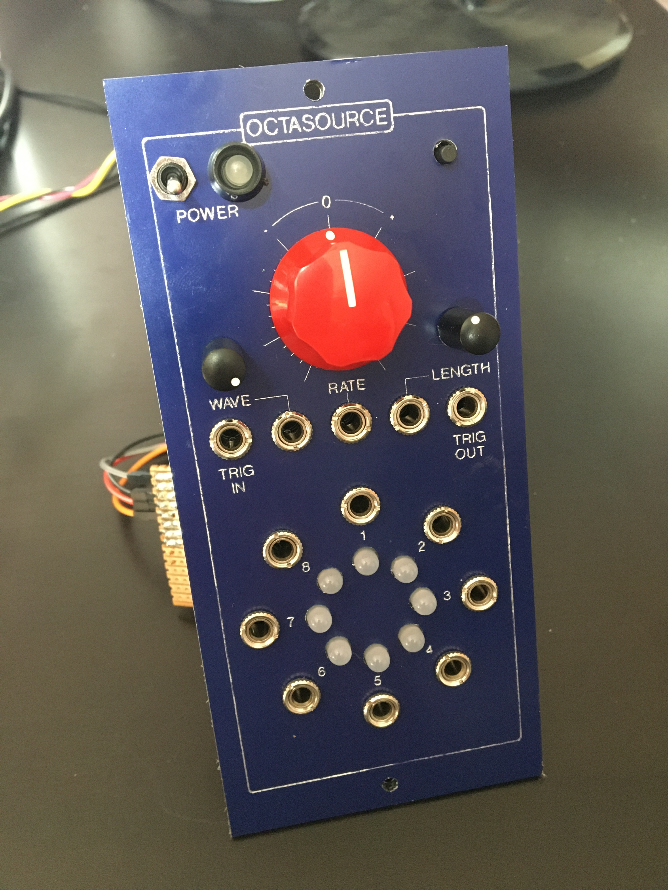

# OctaSource

8 output low frequency oscillator, with various modes to created related low frequency control voltages for synthesizers.

Uses [PJRC Teensy 4.0](https://www.pjrc.com/teensy-4-0/) and [MikroElektronika PIXI Click](https://www.mikroe.com/pixi-click) for IO.

### Features
* Requires a +12V/0V/-12V bipolar power supply.
* Output voltage range is -5V to 5V by default. (The MAX11300 IC used can also output a range of 0 to 10V, this is changeable in code)
* Rate control - Can can go backwards as well as forwards.
* Wave control - Changes the waveshape of the output between ramp, triangle, since and square.
* Amplitude control - Change amplitude of all 8 outputs. (Labelled as length in the prototype photos)
* CV inputs to change these 3 parameters, also with voltage range -5V to 5V.
* A mode switch to switch between differnet modes (see list below).
* Trigger input which is used in some modes. Triggers when voltage exceeds 3V.
* Trigger output which is used in some modes.

### Prototype

 

---

## Modes

There are various modes which can be cycled through by pressing the mode switch.

### 1 Phased

Each output wave is the same frequency but phase shifted by 45 degrees.

### 2 Multiplied

Each output is double the frequency of the previous output.

### 3 Uncorrelated

A range of frequency outputs that are uncorrelated to each other. In this case multiplied by an irrational number, Pi.

---

## Synchronising Multiple Modules

(NOT YET IMPLEMENTED)
The number of outputs can be extended by attaching another Octasource module. The 2 modules can be synchronised with each other.

---

## Calibration

Hold down mode switch while powering on. The top LED will light up red.

Release the mode switch, and turn all potentiometers to the leftmost position.

Press the mode switch. The top LED will turn blue.

Turn all potentiometers to the rightmost position.

Press the mode switch.

The module is now calibrated.
