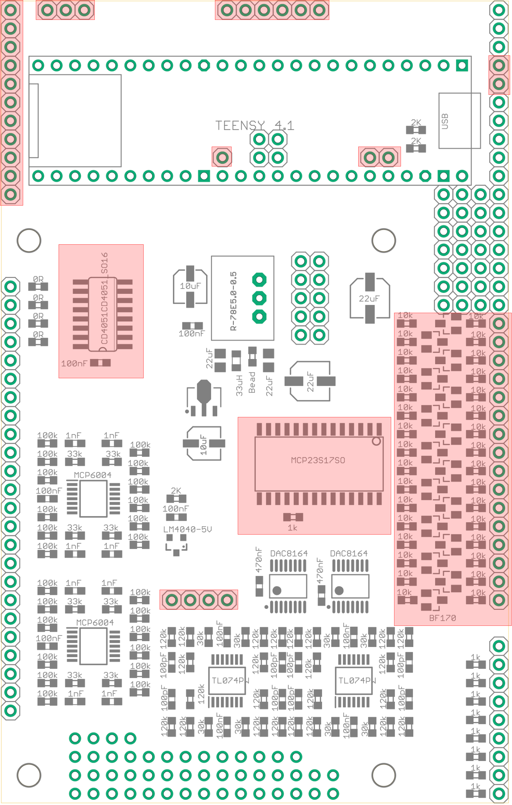

# Build Guide

## Base Board

- Solder surface mount components onto base board. The components highlighted in red above do NOT need to be soldered.

- Solder the power header (male header pins).

- Solder the teensy header (female header). The 4 inner pins only need to be soldered if using a Teensy 4.0, solder the full 24 pin header on the outer rows, this will allow easy expansion to Teensy 4.1 if required later.

- Solder the through hole voltage regulator.

- Solder the male header pins on the opposite side of the board. Headers marked in red above do not need to be soldered.

